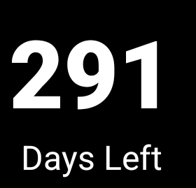

# Days Left Widget

A simple and lightweight Android home screen widget that displays the number of days left in the current year. The widget automatically updates at midnight every day to reflect the new count.

## Features
- Displays the remaining days in the current year
- Automatically updates at **midnight** using `AlarmManager`
- Dynamically adjusts text size based on the widget size
- Works efficiently with minimal battery usage
- No manual refresh required

## Screenshots


## Installation
1. Clone this repository:
   ```bash
   git clone https://github.com/shalomarputhasingh/daysInYearApp.git
   ```
2. Open the project in **Android Studio**.
3. Build and install the APK on your Android device.

## Usage
1. **Add the widget** to your home screen:
   - Long press on the home screen.
   - Select **Widgets**.
   - Find and add **Days Left Widget**.
2. The widget will display the number of days remaining in the year.
3. It will automatically update every day at **midnight**.

## Code Overview
### `DaysLeftWidget.kt`
- Handles widget updates and scheduling automatic refresh at midnight.
- Uses `AlarmManager` to trigger updates daily.
- Dynamically adjusts text size for better visibility.

### `widget_layout.xml`
- Defines the UI structure of the widget.
- Displays the **number of days left** in large text and "Days Left" in smaller text.

## How It Works
1. When added, the widget **calculates** the remaining days in the year.
2. It **registers an alarm** to update at **midnight**.
3. The number automatically updates at **12:00 AM** every day.

## Requirements
- **Android 6.0+ (API Level 23+)**
- **Kotlin**
- **Android Studio**

## Future Improvements
- Add **customization options** (e.g., text color, font style)
- Support for **different time zones**
- Option to **display additional date-related info**

## License
This project is licensed under the **MIT License**.

---

**Enjoy your minimal and elegant Days Left Widget! 🎉**

